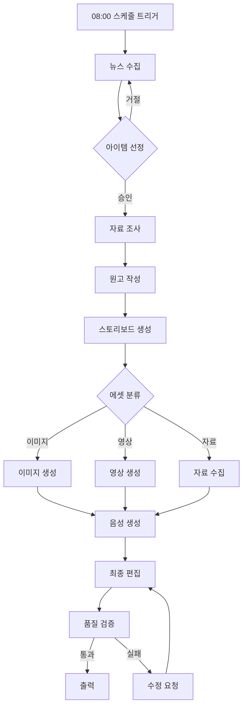

# 🎬 AI 콘텐츠 제작 에이전트 시스템 - 상세 설계서

## 📋 목차
1. [시스템 개요](#1-시스템-개요)
2. [핵심 아키텍처](#2-핵심-아키텍처)
3. [에이전트 페르소나 정의](#3-에이전트-페르소나-정의)
4. [워크플로우 메커니즘](#4-워크플로우-메커니즘)
5. [기술 구현 상세](#5-기술-구현-상세)
6. [데이터 플로우](#6-데이터-플로우)
7. [자동화 스케줄링](#7-자동화-스케줄링)
8. [구현 코드 예시](#8-구현-코드-예시)

---

## 1. 시스템 개요

### 1.1 목표
**"세상의모든지식"** 유튜브 채널의 콘텐츠 제작 프로세스를 완전 자동화하는 AI 멀티 에이전트 시스템 구축

### 1.2 핵심 기능
- 🕐 **매일 오전 8시** 자동 뉴스 수집 및 아이템 선정
- 📝 **자동 기획** 및 자료 조사
- ✍️ **원고 작성** 및 스크립트 생성
- 🎨 **스토리보드** 자동 생성
- 🎬 **영상/이미지** 자동 제작
- 🎙️ **TTS 더빙** 자동 생성
- 🎞️ **최종 영상** 자동 편집 및 출력

---

## 2. 핵심 아키텍처

### 2.1 시스템 구조
```
┌─────────────────────────────────────────────────────────┐
│                    Orchestrator Agent                     │
│                  (전체 워크플로우 관리)                    │
└────────────────────────┬────────────────────────────────┘
                         │
     ┌───────────────────┼───────────────────┐
     │                   │                   │
┌────▼─────┐     ┌──────▼──────┐     ┌──────▼──────┐
│ Planning │     │ Production  │     │    Post     │
│  Phase   │────▶│    Phase    │────▶│ Production  │
└──────────┘     └─────────────┘     └─────────────┘
     │                   │                   │
  Agents:            Agents:            Agents:
  - Researcher       - Designer         - Editor
  - Writer          - Animator         - Publisher
  - Planner         - Narrator
```

### 2.2 기술 스택
```yaml
Backend:
  - Runtime: Node.js 18+
  - Functions: Netlify Functions (Serverless)
  - Database: Supabase (PostgreSQL)
  - Queue: Supabase Realtime / Redis
  - Storage: Supabase Storage / Cloudinary

AI Services:
  - LLM: OpenAI GPT-4, Claude 3, Gemini Pro
  - Image: Flux, DALL-E 3, Midjourney
  - Video: Runway Gen-3, Pika, Haiper
  - Audio: ElevenLabs, Google Cloud TTS
  - Search: Serper API, Google Custom Search

Frontend:
  - Framework: Vue 3
  - State: Pinia
  - UI: Custom Components
  - Monitoring: Real-time Dashboard
```

---

## 3. 에이전트 페르소나 정의

### 3.1 Research Agent (리서처)
```javascript
{
  id: "researcher",
  name: "리서치 전문가",
  personality: "호기심이 많고 분석적이며, 팩트체크에 철저함",
  
  capabilities: [
    "뉴스 크롤링 및 트렌드 분석",
    "주제 관련 심층 자료 수집",
    "신뢰도 평가 및 팩트체크",
    "경쟁 콘텐츠 분석"
  ],
  
  tools: [
    "NaverNewsAPI",
    "GoogleScholar",
    "WikipediaAPI",
    "SerperAPI",
    "FactCheckAPI"
  ],
  
  outputs: {
    itemProposal: {
      topic: "string",
      relevance: "number (0-100)",
      sources: "array",
      competitorAnalysis: "object",
      factCheckResults: "object"
    }
  }
}
```

### 3.2 Writer Agent (작가)
```javascript
{
  id: "writer",
  name: "콘텐츠 작가",
  personality: "창의적이고 논리적이며, 스토리텔링에 능숙함",
  
  capabilities: [
    "원고 구조화 및 작성",
    "스토리텔링 및 내러티브 구성",
    "교육적 콘텐츠 최적화",
    "씬 분할 및 타이밍 설정"
  ],
  
  prompts: {
    structuring: `
      당신은 "세상의모든지식" 채널의 전문 작가입니다.
      주어진 리서치 자료를 바탕으로 10분 분량의 교육 콘텐츠 원고를 작성하세요.
      
      구조:
      1. 후킹 인트로 (0-30초)
      2. 핵심 내용 전개 (30초-8분)
      3. 임팩트 있는 마무리 (8-10분)
      
      톤: 친근하면서도 전문적
      타겟: 20-40대 지식 탐구자
    `,
    
    sceneBreakdown: `
      원고를 씬 단위로 분할하세요.
      각 씬마다:
      - 지속 시간
      - 나레이션 텍스트
      - 필요한 비주얼 요소
      - 감정톤
      를 명시하세요.
    `
  }
}
```

### 3.3 Visual Director Agent (비주얼 디렉터)
```javascript
{
  id: "visualDirector",
  name: "비주얼 디렉터",
  personality: "시각적 사고가 뛰어나고 디테일에 강함",
  
  capabilities: [
    "스토리보드 작성",
    "비주얼 컨셉 기획",
    "씬별 구도 및 전환 설계",
    "에셋 요구사항 정의"
  ],
  
  storyboardFormat: {
    scene: {
      number: "integer",
      duration: "seconds",
      narration: "string",
      visualType: "image|video|animation|infographic",
      
      visualDescription: {
        mainSubject: "string",
        composition: "string",
        mood: "string",
        colorPalette: "array",
        cameraAngle: "string",
        transition: "cut|fade|wipe|zoom"
      },
      
      assetRequirements: {
        type: "generate|stock|custom",
        prompt: "string",
        style: "string",
        reference: "url"
      }
    }
  }
}
```

### 3.4 Designer Agent (디자이너)
```javascript
{
  id: "designer",
  name: "비주얼 아티스트",
  personality: "창의적이고 트렌드에 민감하며 완벽주의적",
  
  capabilities: [
    "AI 이미지 생성",
    "인포그래픽 제작",
    "썸네일 디자인",
    "비주얼 에셋 큐레이션"
  ],
  
  imageGenerationStrategy: {
    thumbnail: {
      model: "flux-pro",
      aspectRatio: "16:9",
      style: "eye-catching, youtube thumbnail",
      elements: ["title text", "key visual", "channel branding"]
    },
    
    sceneImage: {
      model: "flux-schnell|dall-e-3",
      aspectRatio: "16:9",
      style: "consistent with storyboard",
      batchProcessing: true
    },
    
    infographic: {
      model: "dall-e-3",
      aspectRatio: "1:1|16:9",
      style: "clean, modern, data visualization"
    }
  }
}
```

### 3.5 Animator Agent (애니메이터)
```javascript
{
  id: "animator",
  name: "모션 디자이너",
  personality: "역동적이고 디테일 지향적",
  
  capabilities: [
    "이미지를 영상으로 변환",
    "모션그래픽 생성",
    "전환효과 적용",
    "타이포그래피 애니메이션"
  ],
  
  videoGenerationRules: {
    priority: {
      high: ["key moments", "emotional peaks", "demonstrations"],
      medium: ["transitions", "b-roll"],
      low: ["static explanations"]
    },
    
    models: {
      runway: "complex motion, high quality",
      pika: "simple motion, fast generation",
      haiper: "stylized animation"
    }
  }
}
```

### 3.6 Narrator Agent (나레이터)
```javascript
{
  id: "narrator",
  name: "음성 전문가",
  personality: "명확하고 감정표현이 풍부함",
  
  capabilities: [
    "TTS 음성 생성",
    "감정톤 조절",
    "속도 및 강세 제어",
    "음향효과 매칭"
  ],
  
  voiceSettings: {
    service: "elevenlabs",
    voice: "korean_male_educational",
    
    emotionMapping: {
      intro: { energy: "high", pace: "medium" },
      explanation: { energy: "medium", pace: "slow" },
      climax: { energy: "high", pace: "fast" },
      conclusion: { energy: "medium", pace: "medium" }
    },
    
    pronunciation: {
      specialTerms: {}, // 전문용어 발음 사전
      emphasis: []      // 강조할 단어
    }
  }
}
```

### 3.7 Editor Agent (편집자)
```javascript
{
  id: "editor",
  name: "영상 편집자",
  personality: "체계적이고 리듬감이 뛰어남",
  
  capabilities: [
    "영상 시퀀싱",
    "오디오 싱크",
    "자막 생성",
    "최종 렌더링"
  ],
  
  editingRules: {
    pacing: {
      intro: "fast cuts, energetic",
      body: "steady rhythm, clear transitions",
      conclusion: "slow down, impactful"
    },
    
    subtitles: {
      style: "modern, readable",
      position: "bottom-center",
      animation: "fade-in"
    },
    
    audioMixing: {
      narration: -3, // dB
      backgroundMusic: -12,
      soundEffects: -6
    }
  }
}
```

---

## 4. 워크플로우 메커니즘

### 4.1 메인 오케스트레이션 플로우


### 4.2 에이전트 간 통신 프로토콜
```javascript
class AgentCommunicationProtocol {
  constructor() {
    this.messageQueue = new Map()
    this.eventBus = new EventEmitter()
    this.state = new SharedState()
  }
  
  // 메시지 전송
  async sendMessage(message) {
    const msg = {
      id: uuid(),
      from: message.from,
      to: message.to,
      type: message.type,
      payload: message.payload,
      timestamp: Date.now(),
      priority: message.priority || 'normal'
    }
    
    // 메시지 큐에 추가
    this.messageQueue.set(msg.id, msg)
    
    // 수신 에이전트에게 알림
    this.eventBus.emit(`message:${msg.to}`, msg)
    
    // 응답 대기
    return await this.waitForResponse(msg.id)
  }
  
  // 브로드캐스트
  broadcast(event, data) {
    this.eventBus.emit(`broadcast:${event}`, {
      timestamp: Date.now(),
      data
    })
  }
  
  // 상태 동기화
  updateSharedState(key, value) {
    this.state.set(key, value)
    this.broadcast('state:updated', { key, value })
  }
}
```

### 4.3 작업 큐 시스템
```javascript
class TaskQueue {
  constructor() {
    this.queues = {
      urgent: [],
      high: [],
      normal: [],
      low: []
    }
    this.processing = new Set()
    this.completed = new Map()
  }
  
  // 작업 추가
  enqueue(task) {
    const queuedTask = {
      ...task,
      id: uuid(),
      status: 'queued',
      queuedAt: Date.now(),
      retryCount: 0
    }
    
    this.queues[task.priority || 'normal'].push(queuedTask)
    return queuedTask.id
  }
  
  // 작업 처리
  async process() {
    // 우선순위별 처리
    for (const priority of ['urgent', 'high', 'normal', 'low']) {
      const queue = this.queues[priority]
      
      while (queue.length > 0 && this.processing.size < this.maxConcurrent) {
        const task = queue.shift()
        this.processing.add(task.id)
        
        // 비동기 처리
        this.executeTask(task)
          .then(result => this.onTaskComplete(task, result))
          .catch(error => this.onTaskError(task, error))
      }
    }
  }
  
  // 작업 실행
  async executeTask(task) {
    const agent = this.getAgent(task.agentId)
    return await agent.execute(task)
  }
  
  // 재시도 로직
  async retryTask(task) {
    if (task.retryCount < this.maxRetries) {
      task.retryCount++
      task.status = 'retrying'
      await this.delay(this.getBackoffDelay(task.retryCount))
      this.enqueue(task)
    } else {
      task.status = 'failed'
      this.handleFailure(task)
    }
  }
}
```

---

## 5. 기술 구현 상세

### 5.1 뉴스 수집 및 아이템 선정
```javascript
// /netlify/functions/newsCollector.js
export async function collectDailyNews() {
  const sources = [
    { type: 'naver', categories: ['IT', '과학', '경제'] },
    { type: 'google', query: 'trending technology' },
    { type: 'reddit', subreddits: ['science', 'technology'] }
  ]
  
  const articles = []
  
  // 병렬 수집
  await Promise.all(sources.map(async (source) => {
    const collector = getCollector(source.type)
    const items = await collector.fetch(source)
    articles.push(...items)
  }))
  
  // AI 분석 및 점수화
  const scoredItems = await analyzeRelevance(articles)
  
  // 상위 5개 선정
  return scoredItems
    .sort((a, b) => b.score - a.score)
    .slice(0, 5)
}

async function analyzeRelevance(articles) {
  const prompt = `
    다음 뉴스 기사들을 분석하여 "세상의모든지식" 채널에 
    적합한 콘텐츠 아이템으로서의 점수를 매겨주세요.
    
    평가 기준:
    1. 교육적 가치 (30점)
    2. 시의성 (20점)
    3. 흥미도 (20점)
    4. 시각화 가능성 (20점)
    5. 타겟 오디언스 적합성 (10점)
    
    기사 목록: ${JSON.stringify(articles)}
  `
  
  const response = await openai.chat.completions.create({
    model: "gpt-4-turbo",
    messages: [{ role: "system", content: prompt }],
    response_format: { type: "json_object" }
  })
  
  return JSON.parse(response.choices[0].message.content)
}
```

### 5.2 자료 조사 엔진
```javascript
// /netlify/functions/researchEngine.js
class ResearchEngine {
  constructor(topic) {
    this.topic = topic
    this.sources = []
    this.facts = []
    this.context = {}
  }
  
  async conduct() {
    // 1단계: 기본 정보 수집
    await this.gatherBasicInfo()
    
    // 2단계: 심층 자료 수집
    await this.deepDive()
    
    // 3단계: 팩트 체크
    await this.verifyFacts()
    
    // 4단계: 구조화
    return this.structureFindings()
  }
  
  async gatherBasicInfo() {
    // Wikipedia
    const wikiData = await this.searchWikipedia(this.topic)
    this.sources.push({ type: 'wikipedia', data: wikiData })
    
    // Google Scholar
    const scholarData = await this.searchScholar(this.topic)
    this.sources.push({ type: 'scholar', data: scholarData })
    
    // News Articles
    const newsData = await this.searchNews(this.topic)
    this.sources.push({ type: 'news', data: newsData })
  }
  
  async deepDive() {
    // 키워드 추출
    const keywords = await this.extractKeywords()
    
    // 관련 주제 탐색
    for (const keyword of keywords) {
      const related = await this.searchRelated(keyword)
      this.context[keyword] = related
    }
    
    // 전문가 의견 수집
    const expertOpinions = await this.findExpertOpinions()
    this.sources.push({ type: 'expert', data: expertOpinions })
  }
  
  async verifyFacts() {
    const verifier = new FactChecker()
    
    for (const fact of this.facts) {
      const verification = await verifier.check(fact)
      fact.verified = verification.status
      fact.confidence = verification.confidence
      fact.sources = verification.sources
    }
    
    // 신뢰도 낮은 팩트 제거
    this.facts = this.facts.filter(f => f.confidence > 0.7)
  }
  
  structureFindings() {
    return {
      topic: this.topic,
      summary: this.generateSummary(),
      mainPoints: this.extractMainPoints(),
      supportingFacts: this.facts,
      visualElements: this.identifyVisualOpportunities(),
      narrativeArc: this.suggestNarrative(),
      sources: this.sources.map(s => ({
        type: s.type,
        credibility: s.credibility,
        keyInfo: s.keyInfo
      }))
    }
  }
}
```

### 5.3 원고 작성 시스템
```javascript
// /netlify/functions/scriptWriter.js
class ScriptWriter {
  constructor(research, style = 'educational') {
    this.research = research
    this.style = style
    this.script = {
      title: '',
      duration: 600, // 10분
      scenes: [],
      narration: '',
      metadata: {}
    }
  }
  
  async write() {
    // 1. 제목 생성
    this.script.title = await this.generateTitle()
    
    // 2. 구조 생성
    const structure = await this.createStructure()
    
    // 3. 씬별 작성
    for (const section of structure.sections) {
      const scene = await this.writeScene(section)
      this.script.scenes.push(scene)
    }
    
    // 4. 전체 흐름 최적화
    await this.optimizeFlow()
    
    // 5. 타이밍 조정
    this.adjustTiming()
    
    return this.script
  }
  
  async writeScene(section) {
    const prompt = `
      섹션: ${section.title}
      내용: ${section.content}
      지속시간: ${section.duration}초
      
      위 정보를 바탕으로 나레이션 스크립트를 작성하세요.
      
      요구사항:
      - 자연스러운 한국어
      - ${this.style} 스타일
      - 시각적 요소 제안 포함
      - 감정 톤 명시
    `
    
    const response = await generateWithAI(prompt)
    
    return {
      number: section.number,
      title: section.title,
      duration: section.duration,
      narration: response.narration,
      visualCues: response.visualCues,
      emotionTone: response.emotion,
      transitions: response.transitions
    }
  }
  
  adjustTiming() {
    const totalDuration = this.script.scenes.reduce((sum, s) => sum + s.duration, 0)
    
    if (totalDuration > this.script.duration) {
      // 압축 필요
      const ratio = this.script.duration / totalDuration
      this.script.scenes.forEach(scene => {
        scene.duration = Math.floor(scene.duration * ratio)
      })
    }
  }
}
```

### 5.4 스토리보드 생성기
```javascript
// /netlify/functions/storyboardGenerator.js
class StoryboardGenerator {
  constructor(script) {
    this.script = script
    this.storyboard = []
    this.assetRequirements = []
  }
  
  async generate() {
    for (const scene of this.script.scenes) {
      const board = await this.createSceneBoard(scene)
      this.storyboard.push(board)
    }
    
    // 전환 효과 추가
    this.addTransitions()
    
    // 에셋 요구사항 정리
    this.compileAssetRequirements()
    
    return {
      storyboard: this.storyboard,
      assets: this.assetRequirements
    }
  }
  
  async createSceneBoard(scene) {
    // AI로 시각적 요소 분석
    const visualAnalysis = await this.analyzeVisualNeeds(scene)
    
    const board = {
      sceneNumber: scene.number,
      duration: scene.duration,
      shots: []
    }
    
    // 샷 분할
    const shots = this.divideIntoShots(scene, visualAnalysis)
    
    for (const shot of shots) {
      board.shots.push({
        type: shot.type, // 'establishing', 'closeup', 'action', etc.
        duration: shot.duration,
        description: shot.description,
        
        visual: {
          type: this.determineVisualType(shot), // 'image', 'video', 'animation'
          prompt: await this.generateVisualPrompt(shot),
          style: this.getVisualStyle(shot),
          composition: shot.composition,
          colorScheme: shot.colors
        },
        
        audio: {
          narration: shot.narration,
          music: shot.musicCue,
          effects: shot.soundEffects
        },
        
        text: {
          overlay: shot.textOverlay,
          subtitle: shot.subtitle,
          graphics: shot.infographics
        }
      })
    }
    
    return board
  }
  
  determineVisualType(shot) {
    // 움직임이 필요한가?
    if (shot.requiresMotion) {
      return 'video'
    }
    
    // 데이터 시각화인가?
    if (shot.hasData) {
      return 'infographic'
    }
    
    // 복잡한 설명인가?
    if (shot.isComplex) {
      return 'animation'
    }
    
    // 기본: 정적 이미지
    return 'image'
  }
  
  async generateVisualPrompt(shot) {
    const basePrompt = shot.description
    
    // 스타일 가이드 적용
    const styleGuide = {
      consistent: "maintain visual consistency with previous shots",
      quality: "high quality, professional",
      aspect: "16:9 aspect ratio",
      mood: shot.mood || "educational"
    }
    
    // 콘텍스트 추가
    const context = {
      scene: `Scene ${shot.sceneNumber}`,
      previousShot: this.getPreviousShot(shot),
      nextShot: this.getNextShot(shot)
    }
    
    return `${basePrompt}. Style: ${JSON.stringify(styleGuide)}. Context: ${JSON.stringify(context)}`
  }
}
```

### 5.5 비주얼 에셋 생성 파이프라인
```javascript
// /netlify/functions/assetPipeline.js
class AssetPipeline {
  constructor(storyboard) {
    this.storyboard = storyboard
    this.generatedAssets = []
    this.assetCache = new Map()
  }
  
  async processAll() {
    const assetTasks = []
    
    for (const scene of this.storyboard) {
      for (const shot of scene.shots) {
        const task = this.createAssetTask(shot)
        assetTasks.push(task)
      }
    }
    
    // 병렬 처리 (최대 5개 동시)
    const results = await this.batchProcess(assetTasks, 5)
    
    return results
  }
  
  createAssetTask(shot) {
    return {
      id: `${shot.sceneNumber}_${shot.shotNumber}`,
      type: shot.visual.type,
      priority: this.calculatePriority(shot),
      
      generate: async () => {
        switch (shot.visual.type) {
          case 'image':
            return await this.generateImage(shot)
          
          case 'video':
            return await this.generateVideo(shot)
          
          case 'animation':
            return await this.generateAnimation(shot)
          
          case 'infographic':
            return await this.generateInfographic(shot)
          
          default:
            return await this.findStockAsset(shot)
        }
      }
    }
  }
  
  async generateImage(shot) {
    // 캐시 확인
    const cacheKey = this.getCacheKey(shot.visual.prompt)
    if (this.assetCache.has(cacheKey)) {
      return this.assetCache.get(cacheKey)
    }
    
    // 모델 선택
    const model = this.selectImageModel(shot)
    
    // 생성
    const result = await fetch('/.netlify/functions/generateFluxImage', {
      method: 'POST',
      body: JSON.stringify({
        prompt: shot.visual.prompt,
        model: model,
        style: shot.visual.style,
        aspectRatio: '16:9',
        quality: 'high'
      })
    })
    
    const image = await result.json()
    
    // 캐시 저장
    this.assetCache.set(cacheKey, image)
    
    return {
      type: 'image',
      url: image.url,
      metadata: image.metadata,
      shot: shot.id
    }
  }
  
  async generateVideo(shot) {
    // 기본 이미지 먼저 생성
    const baseImage = await this.generateImage(shot)
    
    // 비디오 생성
    const result = await fetch('/.netlify/functions/generateVideoAsync', {
      method: 'POST',
      body: JSON.stringify({
        imageUrl: baseImage.url,
        prompt: shot.visual.prompt,
        model: 'runway-gen3',
        duration: shot.duration,
        motion: shot.visual.motion || 'auto'
      })
    })
    
    const video = await result.json()
    
    // 폴링으로 완료 대기
    const finalVideo = await this.pollVideoStatus(video.id)
    
    return {
      type: 'video',
      url: finalVideo.url,
      duration: finalVideo.duration,
      shot: shot.id
    }
  }
}
```

### 5.6 오디오 생성 및 동기화
```javascript
// /netlify/functions/audioProcessor.js
class AudioProcessor {
  constructor(script, voice = 'korean_male') {
    this.script = script
    this.voice = voice
    this.audioSegments = []
  }
  
  async generateNarration() {
    for (const scene of this.script.scenes) {
      const audio = await this.generateSceneAudio(scene)
      this.audioSegments.push(audio)
    }
    
    // 오디오 합치기
    const fullAudio = await this.mergeAudioSegments()
    
    // 음악 및 효과음 추가
    const finalAudio = await this.addBackgroundElements(fullAudio)
    
    return finalAudio
  }
  
  async generateSceneAudio(scene) {
    // 감정 분석
    const emotion = this.analyzeEmotion(scene.emotionTone)
    
    // TTS 생성
    const result = await fetch('/.netlify/functions/generateSpeech', {
      method: 'POST',
      body: JSON.stringify({
        text: scene.narration,
        voice: this.voice,
        emotion: emotion,
        speed: scene.pacing || 1.0,
        emphasis: scene.emphasis || []
      })
    })
    
    const audio = await result.json()
    
    return {
      url: audio.url,
      duration: audio.duration,
      waveform: audio.waveform,
      scene: scene.number
    }
  }
  
  async addBackgroundElements(narration) {
    // 배경음악 선택
    const music = await this.selectBackgroundMusic()
    
    // 타이밍 맵 생성
    const timingMap = this.createTimingMap(narration)
    
    // 효과음 매핑
    const effects = await this.mapSoundEffects(timingMap)
    
    // 오디오 믹싱
    const mixed = await this.mixAudio({
      narration: { track: narration, volume: 1.0 },
      music: { track: music, volume: 0.3 },
      effects: effects.map(e => ({ track: e, volume: 0.5 }))
    })
    
    return mixed
  }
}
```

### 5.7 최종 편집 및 렌더링
```javascript
// /netlify/functions/videoEditor.js
class VideoEditor {
  constructor(assets, audio, storyboard) {
    this.assets = assets
    this.audio = audio
    this.storyboard = storyboard
    this.timeline = []
  }
  
  async compile() {
    // 1. 타임라인 생성
    this.createTimeline()
    
    // 2. 자막 생성
    const subtitles = await this.generateSubtitles()
    
    // 3. 편집 명령 생성
    const editCommands = this.generateEditCommands()
    
    // 4. FFmpeg 렌더링
    const video = await this.render(editCommands)
    
    // 5. 품질 검증
    const validated = await this.validateOutput(video)
    
    return validated
  }
  
  createTimeline() {
    let currentTime = 0
    
    for (const scene of this.storyboard) {
      for (const shot of scene.shots) {
        const asset = this.findAsset(shot.id)
        
        this.timeline.push({
          start: currentTime,
          end: currentTime + shot.duration,
          asset: asset,
          transitions: shot.transitions,
          overlays: shot.text,
          effects: shot.effects
        })
        
        currentTime += shot.duration
      }
    }
  }
  
  generateEditCommands() {
    const commands = []
    
    // 입력 파일들
    this.timeline.forEach((clip, index) => {
      commands.push(`-i ${clip.asset.url}`)
    })
    
    // 오디오
    commands.push(`-i ${this.audio.url}`)
    
    // 필터 체인
    const filters = []
    
    // 스케일링
    filters.push('[0:v]scale=1920:1080[v0]')
    
    // 전환 효과
    this.timeline.forEach((clip, index) => {
      if (clip.transitions) {
        filters.push(this.createTransitionFilter(clip, index))
      }
    })
    
    // 텍스트 오버레이
    this.timeline.forEach((clip, index) => {
      if (clip.overlays) {
        filters.push(this.createTextFilter(clip, index))
      }
    })
    
    // 컨캣
    filters.push(`concat=n=${this.timeline.length}:v=1:a=0[outv]`)
    
    commands.push(`-filter_complex "${filters.join(';')}"`)
    
    // 출력 설정
    commands.push('-map "[outv]"')
    commands.push('-map 1:a')  // 오디오
    commands.push('-c:v libx264')
    commands.push('-preset fast')
    commands.push('-crf 23')
    commands.push('-c:a aac')
    commands.push('-b:a 192k')
    
    return commands
  }
  
  async validateOutput(video) {
    const checks = {
      duration: Math.abs(video.duration - this.targetDuration) < 5,
      resolution: video.width === 1920 && video.height === 1080,
      audioSync: await this.checkAudioSync(video),
      quality: await this.assessQuality(video)
    }
    
    if (Object.values(checks).every(check => check)) {
      return video
    } else {
      // 문제 있으면 재편집
      return await this.reEdit(video, checks)
    }
  }
}
```

---

## 6. 데이터 플로우

### 6.1 데이터베이스 스키마
```sql
-- 프로덕션 프로젝트
CREATE TABLE production_projects (
  id UUID PRIMARY KEY DEFAULT gen_random_uuid(),
  title VARCHAR(500) NOT NULL,
  topic TEXT NOT NULL,
  source_url TEXT,
  status VARCHAR(50) DEFAULT 'planning',
  
  -- 단계별 데이터
  research_data JSONB,
  script_data JSONB,
  storyboard_data JSONB,
  assets_data JSONB,
  
  -- 타임스탬프
  scheduled_at TIMESTAMPTZ,
  started_at TIMESTAMPTZ,
  completed_at TIMESTAMPTZ,
  published_at TIMESTAMPTZ,
  
  -- 메타데이터
  metadata JSONB DEFAULT '{}',
  error_log JSONB DEFAULT '[]',
  
  created_at TIMESTAMPTZ DEFAULT NOW(),
  updated_at TIMESTAMPTZ DEFAULT NOW()
);

-- 에이전트 작업 로그
CREATE TABLE agent_tasks (
  id UUID PRIMARY KEY DEFAULT gen_random_uuid(),
  project_id UUID REFERENCES production_projects(id),
  agent_id VARCHAR(50) NOT NULL,
  task_type VARCHAR(100) NOT NULL,
  
  -- 작업 데이터
  input_data JSONB,
  output_data JSONB,
  
  -- 상태
  status VARCHAR(50) DEFAULT 'pending',
  progress INTEGER DEFAULT 0,
  
  -- 성능 메트릭
  start_time TIMESTAMPTZ,
  end_time TIMESTAMPTZ,
  duration_ms INTEGER,
  tokens_used INTEGER,
  cost_usd DECIMAL(10, 4),
  
  -- 에러 처리
  retry_count INTEGER DEFAULT 0,
  error_message TEXT,
  
  created_at TIMESTAMPTZ DEFAULT NOW()
);

-- 생성된 에셋
CREATE TABLE production_assets (
  id UUID PRIMARY KEY DEFAULT gen_random_uuid(),
  project_id UUID REFERENCES production_projects(id),
  task_id UUID REFERENCES agent_tasks(id),
  
  -- 에셋 정보
  asset_type VARCHAR(50) NOT NULL, -- image, video, audio, text
  scene_number INTEGER,
  shot_number INTEGER,
  
  -- 파일 정보
  url TEXT NOT NULL,
  backup_url TEXT,
  file_size INTEGER,
  duration_seconds DECIMAL(10, 2),
  
  -- 메타데이터
  metadata JSONB DEFAULT '{}',
  generation_params JSONB,
  
  -- 품질 메트릭
  quality_score DECIMAL(3, 2),
  usage_count INTEGER DEFAULT 0,
  
  created_at TIMESTAMPTZ DEFAULT NOW()
);

-- 에이전트 간 메시지
CREATE TABLE agent_messages (
  id UUID PRIMARY KEY DEFAULT gen_random_uuid(),
  project_id UUID REFERENCES production_projects(id),
  
  from_agent VARCHAR(50) NOT NULL,
  to_agent VARCHAR(50) NOT NULL,
  message_type VARCHAR(100) NOT NULL,
  
  payload JSONB NOT NULL,
  response JSONB,
  
  status VARCHAR(50) DEFAULT 'sent',
  
  sent_at TIMESTAMPTZ DEFAULT NOW(),
  received_at TIMESTAMPTZ,
  responded_at TIMESTAMPTZ
);

-- 품질 검증 로그
CREATE TABLE quality_checks (
  id UUID PRIMARY KEY DEFAULT gen_random_uuid(),
  project_id UUID REFERENCES production_projects(id),
  
  check_type VARCHAR(100) NOT NULL,
  target_id UUID, -- asset_id or task_id
  
  criteria JSONB NOT NULL,
  results JSONB NOT NULL,
  
  passed BOOLEAN DEFAULT false,
  score DECIMAL(5, 2),
  
  feedback TEXT,
  
  checked_at TIMESTAMPTZ DEFAULT NOW()
);
```

### 6.2 상태 관리 (Pinia Store)
```javascript
// /stores/productionStore.js
export const useProductionStore = defineStore('production', {
  state: () => ({
    // 현재 프로젝트
    currentProject: null,
    
    // 에이전트 상태
    agents: {
      researcher: { status: 'idle', progress: 0 },
      writer: { status: 'idle', progress: 0 },
      visualDirector: { status: 'idle', progress: 0 },
      designer: { status: 'idle', progress: 0 },
      animator: { status: 'idle', progress: 0 },
      narrator: { status: 'idle', progress: 0 },
      editor: { status: 'idle', progress: 0 }
    },
    
    // 파이프라인 상태
    pipeline: {
      stage: 'idle', // idle, planning, production, post, complete
      currentTask: null,
      queue: [],
      completed: []
    },
    
    // 실시간 로그
    logs: [],
    
    // 에러
    errors: []
  }),
  
  getters: {
    overallProgress: (state) => {
      const stages = ['planning', 'production', 'post']
      const currentIndex = stages.indexOf(state.pipeline.stage)
      if (currentIndex === -1) return 0
      
      const baseProgress = (currentIndex / stages.length) * 100
      const stageProgress = state.getCurrentStageProgress()
      
      return baseProgress + (stageProgress / stages.length)
    },
    
    activeAgents: (state) => {
      return Object.entries(state.agents)
        .filter(([_, agent]) => agent.status === 'working')
        .map(([id, agent]) => ({ id, ...agent }))
    }
  },
  
  actions: {
    async startProduction(topic) {
      this.currentProject = {
        id: generateId(),
        topic,
        startedAt: new Date()
      }
      
      this.pipeline.stage = 'planning'
      
      // 오케스트레이터 시작
      const orchestrator = new ProductionOrchestrator(this)
      await orchestrator.run(topic)
    },
    
    updateAgentStatus(agentId, status, progress = null) {
      this.agents[agentId].status = status
      if (progress !== null) {
        this.agents[agentId].progress = progress
      }
      
      this.log(`Agent ${agentId}: ${status} ${progress ? `(${progress}%)` : ''}`)
    },
    
    log(message, level = 'info') {
      this.logs.push({
        timestamp: new Date(),
        level,
        message
      })
      
      // 실시간 알림
      if (level === 'error') {
        this.notifyError(message)
      }
    }
  }
})
```

---

## 7. 자동화 스케줄링

### 7.1 크론 스케줄러
```javascript
// /netlify/functions/scheduler.js
import { CronJob } from 'cron'
import { ProductionOrchestrator } from './orchestrator'

// 매일 오전 8시 실행
const dailyProductionJob = new CronJob(
  '0 8 * * *', // 크론 표현식
  async () => {
    console.log('Starting daily content production...')
    
    try {
      // 1. 뉴스 수집
      const newsItems = await collectDailyNews()
      
      // 2. 최적 아이템 선정
      const selectedItem = await selectBestItem(newsItems)
      
      // 3. 프로덕션 시작
      const orchestrator = new ProductionOrchestrator()
      const result = await orchestrator.produce(selectedItem)
      
      // 4. 결과 저장
      await saveProductionResult(result)
      
      // 5. 알림 전송
      await notifyCompletion(result)
      
    } catch (error) {
      console.error('Production failed:', error)
      await notifyError(error)
    }
  },
  null,
  true, // 자동 시작
  'Asia/Seoul' // 한국 시간대
)

// 수동 트리거 엔드포인트
export const handler = async (event) => {
  if (event.httpMethod === 'POST') {
    const { action, data } = JSON.parse(event.body)
    
    switch (action) {
      case 'trigger':
        // 수동 실행
        await dailyProductionJob.fireOnTick()
        return { statusCode: 200, body: 'Production started' }
      
      case 'schedule':
        // 스케줄 변경
        dailyProductionJob.setTime(new CronTime(data.cronExpression))
        return { statusCode: 200, body: 'Schedule updated' }
      
      case 'status':
        // 상태 확인
        return {
          statusCode: 200,
          body: JSON.stringify({
            running: dailyProductionJob.running,
            nextRun: dailyProductionJob.nextDate()
          })
        }
      
      default:
        return { statusCode: 400, body: 'Unknown action' }
    }
  }
}
```

### 7.2 작업 큐 관리
```javascript
// /utils/queueManager.js
class QueueManager {
  constructor() {
    this.queues = {
      research: new Queue('research', { concurrency: 2 }),
      writing: new Queue('writing', { concurrency: 1 }),
      visual: new Queue('visual', { concurrency: 5 }),
      audio: new Queue('audio', { concurrency: 3 }),
      editing: new Queue('editing', { concurrency: 1 })
    }
    
    this.setupHandlers()
  }
  
  setupHandlers() {
    // Research Queue
    this.queues.research.process(async (job) => {
      const agent = new ResearchAgent()
      return await agent.process(job.data)
    })
    
    // Writing Queue
    this.queues.writing.process(async (job) => {
      const agent = new WriterAgent()
      return await agent.process(job.data)
    })
    
    // Visual Queue
    this.queues.visual.process(async (job) => {
      const agent = job.data.type === 'design' 
        ? new DesignerAgent()
        : new AnimatorAgent()
      return await agent.process(job.data)
    })
    
    // 진행 상황 추적
    Object.values(this.queues).forEach(queue => {
      queue.on('progress', (job, progress) => {
        this.updateProgress(job.id, progress)
      })
      
      queue.on('completed', (job, result) => {
        this.onJobComplete(job.id, result)
      })
      
      queue.on('failed', (job, error) => {
        this.onJobFailed(job.id, error)
      })
    })
  }
  
  async addJob(type, data, options = {}) {
    const queue = this.queues[type]
    if (!queue) throw new Error(`Unknown queue type: ${type}`)
    
    const job = await queue.add(data, {
      priority: options.priority || 0,
      delay: options.delay || 0,
      attempts: options.attempts || 3,
      backoff: {
        type: 'exponential',
        delay: 2000
      }
    })
    
    return job.id
  }
}
```

---

## 8. 구현 코드 예시

### 8.1 메인 오케스트레이터
```javascript
// /services/ProductionOrchestrator.js
export class ProductionOrchestrator {
  constructor(store) {
    this.store = store
    this.agents = this.initializeAgents()
    this.state = 'idle'
  }
  
  initializeAgents() {
    return {
      researcher: new ResearchAgent(),
      writer: new WriterAgent(),
      visualDirector: new VisualDirectorAgent(),
      designer: new DesignerAgent(),
      animator: new AnimatorAgent(),
      narrator: new NarratorAgent(),
      editor: new EditorAgent()
    }
  }
  
  async run(topic) {
    try {
      this.state = 'running'
      this.store.log(`Production started for topic: ${topic}`)
      
      // Phase 1: Research & Planning
      const research = await this.runPhase('research', async () => {
        return await this.agents.researcher.collectData(topic)
      })
      
      // Phase 2: Script Writing
      const script = await this.runPhase('writing', async () => {
        return await this.agents.writer.writeScript(research)
      })
      
      // Phase 3: Storyboarding
      const storyboard = await this.runPhase('storyboarding', async () => {
        return await this.agents.visualDirector.createStoryboard(script)
      })
      
      // Phase 4: Asset Creation (병렬 처리)
      const assets = await this.runPhase('assetCreation', async () => {
        const tasks = []
        
        // 이미지 생성
        tasks.push(this.agents.designer.createImages(storyboard))
        
        // 나레이션 생성
        tasks.push(this.agents.narrator.generateNarration(script))
        
        const [images, narration] = await Promise.all(tasks)
        
        // 필요한 경우 비디오 생성
        const videos = await this.agents.animator.createVideos(images, storyboard)
        
        return { images, videos, narration }
      })
      
      // Phase 5: Final Editing
      const finalVideo = await this.runPhase('editing', async () => {
        return await this.agents.editor.compile(assets, storyboard)
      })
      
      // Phase 6: Quality Check
      const validated = await this.runPhase('validation', async () => {
        return await this.validateOutput(finalVideo)
      })
      
      this.state = 'complete'
      this.store.log('Production completed successfully')
      
      return validated
      
    } catch (error) {
      this.state = 'error'
      this.store.log(`Production failed: ${error.message}`, 'error')
      throw error
    }
  }
  
  async runPhase(phaseName, executor) {
    this.store.pipeline.stage = phaseName
    this.store.log(`Starting phase: ${phaseName}`)
    
    const startTime = Date.now()
    
    try {
      const result = await executor()
      
      const duration = Date.now() - startTime
      this.store.log(`Phase ${phaseName} completed in ${duration}ms`)
      
      return result
      
    } catch (error) {
      this.store.log(`Phase ${phaseName} failed: ${error.message}`, 'error')
      
      // 재시도 로직
      if (this.shouldRetry(phaseName, error)) {
        this.store.log(`Retrying phase: ${phaseName}`)
        return await this.runPhase(phaseName, executor)
      }
      
      throw error
    }
  }
  
  shouldRetry(phase, error) {
    // 재시도 가능한 에러 타입 확인
    const retryableErrors = ['TIMEOUT', 'RATE_LIMIT', 'TEMPORARY_FAILURE']
    return retryableErrors.includes(error.code) && this.retryCount[phase] < 3
  }
  
  async validateOutput(video) {
    const checks = {
      duration: this.checkDuration(video),
      quality: await this.checkQuality(video),
      audio: await this.checkAudioSync(video),
      compliance: await this.checkCompliance(video)
    }
    
    const allPassed = Object.values(checks).every(check => check.passed)
    
    if (!allPassed) {
      const failures = Object.entries(checks)
        .filter(([_, check]) => !check.passed)
        .map(([name, check]) => ({
          name,
          issue: check.issue,
          suggestion: check.suggestion
        }))
      
      // 자동 수정 시도
      if (this.canAutoFix(failures)) {
        return await this.autoFix(video, failures)
      }
      
      throw new ValidationError('Quality check failed', failures)
    }
    
    return video
  }
}
```

### 8.2 Vue 컴포넌트 예시
```vue
<!-- /components/production/ProductionDashboard.vue -->
<template>
  <div class="production-dashboard">
    <!-- 헤더 -->
    <div class="dashboard-header">
      <h1>AI 콘텐츠 제작 시스템</h1>
      <div class="status-indicator" :class="productionStore.pipeline.stage">
        {{ productionStore.pipeline.stage }}
      </div>
    </div>
    
    <!-- 메인 컨트롤 -->
    <div class="main-controls">
      <div class="topic-input">
        <input 
          v-model="topic" 
          placeholder="주제 입력 또는 자동 선택"
          @keyup.enter="startProduction"
        />
        <button @click="autoSelectTopic" class="auto-btn">
          <Sparkles :size="20" />
          자동 선택
        </button>
      </div>
      
      <button 
        @click="startProduction" 
        :disabled="!topic || isProducing"
        class="start-btn"
      >
        <Play :size="20" />
        제작 시작
      </button>
    </div>
    
    <!-- 에이전트 모니터 -->
    <div class="agents-grid">
      <AgentMonitor
        v-for="(agent, id) in productionStore.agents"
        :key="id"
        :agent-id="id"
        :status="agent.status"
        :progress="agent.progress"
      />
    </div>
    
    <!-- 파이프라인 뷰 -->
    <div class="pipeline-view">
      <PipelineStage
        v-for="stage in pipelineStages"
        :key="stage.id"
        :stage="stage"
        :active="productionStore.pipeline.stage === stage.id"
        :completed="isStageCompleted(stage.id)"
      />
    </div>
    
    <!-- 실시간 프리뷰 -->
    <div class="preview-section">
      <div class="preview-tabs">
        <button 
          v-for="tab in previewTabs"
          :key="tab.id"
          @click="activePreview = tab.id"
          :class="{ active: activePreview === tab.id }"
        >
          {{ tab.label }}
        </button>
      </div>
      
      <div class="preview-content">
        <!-- 스크립트 프리뷰 -->
        <ScriptPreview 
          v-if="activePreview === 'script'"
          :script="currentScript"
        />
        
        <!-- 스토리보드 프리뷰 -->
        <StoryboardPreview
          v-if="activePreview === 'storyboard'"
          :storyboard="currentStoryboard"
        />
        
        <!-- 비디오 프리뷰 -->
        <VideoPreview
          v-if="activePreview === 'video'"
          :video-url="currentVideo"
        />
      </div>
    </div>
    
    <!-- 로그 콘솔 -->
    <div class="log-console">
      <div class="log-header">
        <Terminal :size="16" />
        <span>실시간 로그</span>
        <button @click="clearLogs" class="clear-btn">
          <Trash2 :size="14" />
        </button>
      </div>
      
      <div class="log-content" ref="logContainer">
        <div
          v-for="log in productionStore.logs"
          :key="log.timestamp"
          :class="['log-entry', log.level]"
        >
          <span class="timestamp">{{ formatTime(log.timestamp) }}</span>
          <span class="message">{{ log.message }}</span>
        </div>
      </div>
    </div>
  </div>
</template>

<script setup>
import { ref, computed, watch, onMounted } from 'vue'
import { useProductionStore } from '@/stores/productionStore'
import { 
  Play, Sparkles, Terminal, Trash2 
} from 'lucide-vue-next'

const productionStore = useProductionStore()

const topic = ref('')
const isProducing = computed(() => 
  productionStore.pipeline.stage !== 'idle'
)
const activePreview = ref('script')

const pipelineStages = [
  { id: 'research', label: '리서치', icon: 'Search' },
  { id: 'writing', label: '원고 작성', icon: 'Edit' },
  { id: 'storyboarding', label: '스토리보드', icon: 'Layout' },
  { id: 'assetCreation', label: '에셋 생성', icon: 'Image' },
  { id: 'editing', label: '편집', icon: 'Film' },
  { id: 'validation', label: '검증', icon: 'CheckCircle' }
]

const previewTabs = [
  { id: 'script', label: '스크립트' },
  { id: 'storyboard', label: '스토리보드' },
  { id: 'video', label: '비디오' }
]

// 자동 주제 선택
const autoSelectTopic = async () => {
  const response = await fetch('/.netlify/functions/newsCollector')
  const items = await response.json()
  
  if (items.length > 0) {
    topic.value = items[0].title
  }
}

// 제작 시작
const startProduction = () => {
  if (!topic.value) return
  productionStore.startProduction(topic.value)
}

// 로그 자동 스크롤
watch(() => productionStore.logs.length, () => {
  nextTick(() => {
    const container = logContainer.value
    if (container) {
      container.scrollTop = container.scrollHeight
    }
  })
})

// 스케줄러 상태 확인
onMounted(async () => {
  const response = await fetch('/.netlify/functions/scheduler', {
    method: 'POST',
    body: JSON.stringify({ action: 'status' })
  })
  
  const status = await response.json()
  console.log('Scheduler status:', status)
})
</script>

<style scoped>
.production-dashboard {
  display: flex;
  flex-direction: column;
  height: 100vh;
  background: var(--bg-primary);
  padding: 20px;
  gap: 20px;
}

.dashboard-header {
  display: flex;
  justify-content: space-between;
  align-items: center;
}

.status-indicator {
  padding: 8px 16px;
  border-radius: 20px;
  font-size: 14px;
  font-weight: 600;
  text-transform: uppercase;
}

.status-indicator.idle {
  background: var(--gray-200);
  color: var(--gray-700);
}

.status-indicator.running {
  background: var(--blue-100);
  color: var(--blue-700);
  animation: pulse 2s infinite;
}

@keyframes pulse {
  0%, 100% { opacity: 1; }
  50% { opacity: 0.7; }
}

.agents-grid {
  display: grid;
  grid-template-columns: repeat(auto-fit, minmax(200px, 1fr));
  gap: 16px;
}

.pipeline-view {
  display: flex;
  gap: 8px;
  padding: 20px;
  background: white;
  border-radius: 12px;
  overflow-x: auto;
}

.preview-section {
  flex: 1;
  background: white;
  border-radius: 12px;
  overflow: hidden;
}

.log-console {
  height: 200px;
  background: #1e1e1e;
  color: #d4d4d4;
  border-radius: 8px;
  display: flex;
  flex-direction: column;
}

.log-content {
  flex: 1;
  overflow-y: auto;
  padding: 12px;
  font-family: 'Monaco', 'Courier New', monospace;
  font-size: 12px;
}

.log-entry {
  display: flex;
  gap: 12px;
  margin-bottom: 4px;
}

.log-entry.error {
  color: #f87171;
}

.log-entry.warning {
  color: #fbbf24;
}

.timestamp {
  color: #6b7280;
  flex-shrink: 0;
}
</style>
```

---

## 🚀 구현 로드맵

### Phase 1: 기초 시스템 (2주)
- [ ] 뉴스 수집 API 연동
- [ ] 기본 에이전트 구조 구현
- [ ] 데이터베이스 스키마 구축
- [ ] 기본 UI 대시보드

### Phase 2: 핵심 에이전트 (3주)
- [ ] Research Agent 구현
- [ ] Writer Agent 구현
- [ ] Designer Agent 구현
- [ ] 에이전트 간 통신 시스템

### Phase 3: 고급 기능 (3주)
- [ ] Visual Director Agent
- [ ] Animator Agent
- [ ] Narrator Agent
- [ ] Editor Agent

### Phase 4: 자동화 및 최적화 (2주)
- [ ] 스케줄러 구현
- [ ] 품질 검증 시스템
- [ ] 성능 최적화
- [ ] 에러 핸들링 강화

### Phase 5: 테스트 및 배포 (2주)
- [ ] 통합 테스트
- [ ] 사용자 피드백 반영
- [ ] 프로덕션 배포
- [ ] 모니터링 시스템 구축

---

## 📝 결론

이 시스템은 **"세상의모든지식"** 채널의 콘텐츠 제작을 완전 자동화할 수 있는 AI 멀티 에이전트 시스템입니다. 각 에이전트가 실제 제작팀의 역할을 수행하며, 서로 유기적으로 협업하여 고품질 콘텐츠를 생산합니다.

### 핵심 장점
- ✅ 완전 자동화된 콘텐츠 제작
- ✅ 24/7 운영 가능
- ✅ 일관된 품질 유지
- ✅ 확장 가능한 아키텍처
- ✅ 실시간 모니터링 및 제어

### 예상 효과
- 제작 시간 90% 단축
- 제작 비용 80% 절감
- 콘텐츠 생산량 10배 증가
- 품질 일관성 보장

이 설계를 기반으로 단계적으로 구현하시면, 완전 자동화된 AI 콘텐츠 제작 시스템을 구축할 수 있습니다.