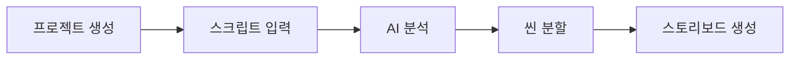
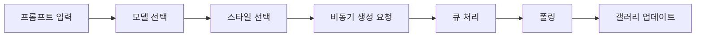
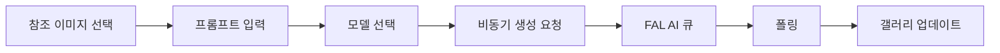

# Kairos AI - 시스템 아키텍처 문서

## 🎯 프로젝트 개요

**Kairos AI**는 AI 기반의 콘텐츠 생성 플랫폼으로, 스토리보드 제작부터 이미지/비디오 생성, TTS까지 통합된 크리에이티브 워크플로우를 제공합니다.

### 핵심 기능
- 📝 AI 기반 스크립트 분석 및 씬 분할
- 🎨 다중 모델 이미지 생성 (GPT-4, Flux)
- 🎬 다중 모델 비디오 생성 (Veo2, Kling, Hailou, SeedDance)
- 🎙️ TTS 오디오 생성
- 📊 스토리보드 관리 시스템
- 🗂️ 프로젝트 기반 워크플로우

## 🏗️ 기술 스택

### Frontend
- **Framework**: Vue 3 (Composition API)
- **Build Tool**: Vite
- **State Management**: Pinia
- **Router**: Vue Router 4
- **UI Components**: Custom Components + Lucide Icons
- **Styling**: CSS Variables + Scoped CSS

### Backend
- **Serverless Functions**: Netlify Functions (ES Modules)
- **Database**: Supabase (PostgreSQL)
- **Authentication**: Supabase Auth (Google OAuth)
- **Storage**: Supabase Storage
- **AI APIs**: 
  - OpenAI (GPT-4, DALL-E)
  - Google Generative AI (Veo2)
  - FAL AI (Flux, Kling, Hailou, SeedDance)

### Deployment
- **Hosting**: Netlify
- **CDN**: Netlify Edge
- **Functions**: Netlify Functions

## 📂 프로젝트 구조

```
kairos-ai/
├── src/                          # Frontend 소스 코드
│   ├── components/              # Vue 컴포넌트
│   │   ├── common/             # 공통 UI 컴포넌트
│   │   ├── generation/         # AI 생성 관련 컴포넌트
│   │   │   ├── ImageGenerationModal.vue
│   │   │   ├── VideoGenerationModal.vue
│   │   │   ├── AIGenerationGallery.vue
│   │   │   ├── VideoGenerationGallery.vue
│   │   │   └── PresetManageModal.vue
│   │   ├── production/         # 스토리보드 관련 컴포넌트
│   │   │   ├── ProductionSheet.vue
│   │   │   ├── ProductionTable.vue
│   │   │   └── ScriptInputModal.vue
│   │   └── modals/            # 모달 컴포넌트
│   ├── views/                 # 페이지 뷰 컴포넌트
│   │   ├── HomeView.vue
│   │   ├── ProjectListView.vue
│   │   ├── ProjectDetailView.vue
│   │   └── ProfileView.vue
│   ├── stores/                # Pinia 스토어
│   │   ├── auth.js           # 인증 상태 관리
│   │   ├── projects.js       # 프로젝트 데이터 관리
│   │   ├── production.js     # 스토리보드 데이터 관리
│   │   └── theme.js          # 테마 관리
│   ├── router/               # Vue Router 설정
│   ├── utils/                # 유틸리티 함수
│   │   └── supabase.js      # Supabase 클라이언트
│   └── composables/          # Vue Composables
├── netlify/functions/        # Serverless Functions
│   ├── AI 생성 함수들
│   │   ├── generateImageAsync.js
│   │   ├── generateVideoAsync.js
│   │   ├── generateVeo2Video.js
│   │   ├── generateKling21Video.js
│   │   ├── generateHailouVideo.js
│   │   └── generateSeedanceVideo.js
│   ├── 처리 큐 함수들
│   │   ├── processImageQueue.js
│   │   └── processVideoQueue.js
│   └── 유틸리티 함수들
│       ├── translatePrompt.js
│       ├── extractImageTags.js
│       └── generateTTS.js
├── database/                 # 데이터베이스 스키마
│   ├── migrations/          # DB 마이그레이션 파일
│   └── SCHEMA.md           # 스키마 문서
└── public/                  # 정적 파일

```

## 🗄️ 데이터베이스 구조

### 핵심 테이블

#### projects
- 프로젝트 기본 정보 및 메타데이터
- 사용자별 프로젝트 관리
- 마지막 사용 설정 저장 (last_image_model, last_video_model 등)

#### production_sheets
- 스토리보드 씬 데이터
- 스크립트, 캐릭터, 미디어 URL 관리
- 프로젝트와 1:N 관계

#### gen_images
- 생성된 이미지 데이터
- 생성 상태, URL, 태그 관리
- production_sheets와 연결 가능

#### gen_videos
- 생성된 비디오 데이터
- 생성 상태, URL, 메타데이터
- production_sheets와 연결 가능

#### prompt_presets
- 사용자 정의 프롬프트 프리셋
- 이미지/비디오별 관리

#### tts_audio
- TTS 오디오 파일 관리
- 씬별 오디오 버전 관리

## 🔄 주요 워크플로우

### 1. 프로젝트 생성 플로우


### 2. 이미지 생성 플로우


### 3. 비디오 생성 플로우


## 🎨 UI/UX 특징

### 모듈식 컴포넌트 구조
- 재사용 가능한 컴포넌트 설계
- 컴포넌트당 최대 200줄 제한
- Props/Emit 기반 통신

### 반응형 디자인
- 모바일, 태블릿, 데스크탑 대응
- Masonry 레이아웃 (갤러리)
- 다크/라이트 테마 지원

### 실시간 업데이트
- 폴링 기반 상태 업데이트
- 5초 간격 자동 새로고침
- 프로그레시브 UI 업데이트

## 🔐 보안 및 인증

### 인증 체계
- Google OAuth 2.0
- Supabase Auth 세션 관리
- JWT 토큰 기반 API 호출

### RLS (Row Level Security)
- 사용자별 데이터 격리
- 프로젝트 기반 접근 제어
- 공개/비공개 설정 지원

## 🚀 성능 최적화

### Frontend 최적화
- 코드 스플리팅 (동적 import)
- 레이지 로딩 (이미지/비디오)
- 컴포넌트 캐싱

### Backend 최적화
- 서버리스 함수 cold start 최소화
- 비동기 처리 (큐 시스템)
- 병렬 처리 (Promise.allSettled)

### 리소스 관리
- 이미지 압축 및 썸네일 생성
- CDN 활용
- 스토리지 최적화

## 📊 모니터링 및 로깅

### 에러 처리
- try-catch 블록 활용
- 사용자 친화적 에러 메시지
- 콘솔 로깅 (개발 환경)

### 상태 추적
- 생성 상태 실시간 추적
- 성공/실패 카운트
- 처리 시간 측정

## 🔧 개발 환경 설정

### 필수 환경 변수
```env
VITE_SUPABASE_URL=
VITE_SUPABASE_ANON_KEY=
OPENAI_API_KEY=
GOOGLE_GENERATIVE_AI_API_KEY=
FAL_KEY=
```

### 개발 명령어
```bash
npm run dev          # 개발 서버 (Vite)
netlify dev          # Netlify 로컬 환경
npm run build        # 프로덕션 빌드
netlify deploy       # 스테이징 배포
netlify deploy --prod # 프로덕션 배포
```

## 📝 코딩 컨벤션

### 네이밍 규칙
- 컴포넌트: PascalCase
- 함수/변수: camelCase
- 상수: UPPER_SNAKE_CASE
- 파일명: kebab-case

### 코드 구조
- ES Modules 사용 (CommonJS 금지)
- Composition API 사용
- async/await 패턴
- 명시적 에러 처리

---

**최종 업데이트**: 2025-01-12
**버전**: 1.0.0
**배포 URL**: https://kairos-ai-pd.netlify.app